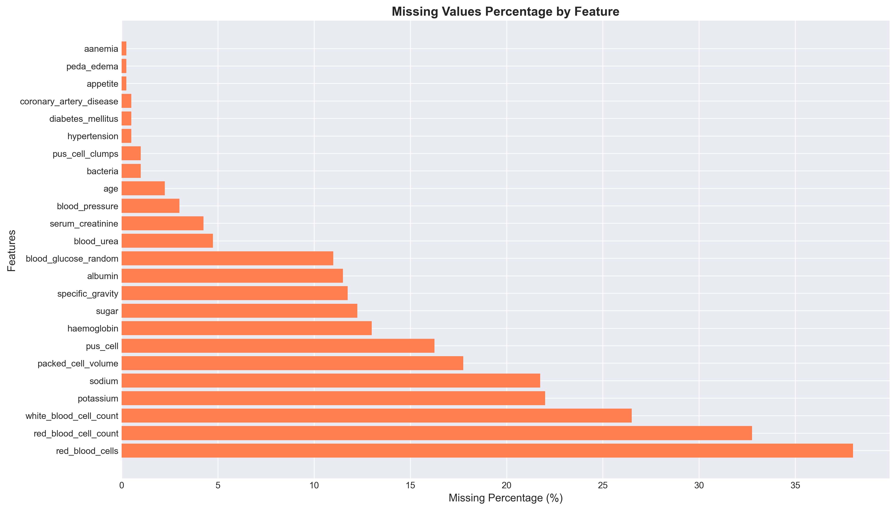
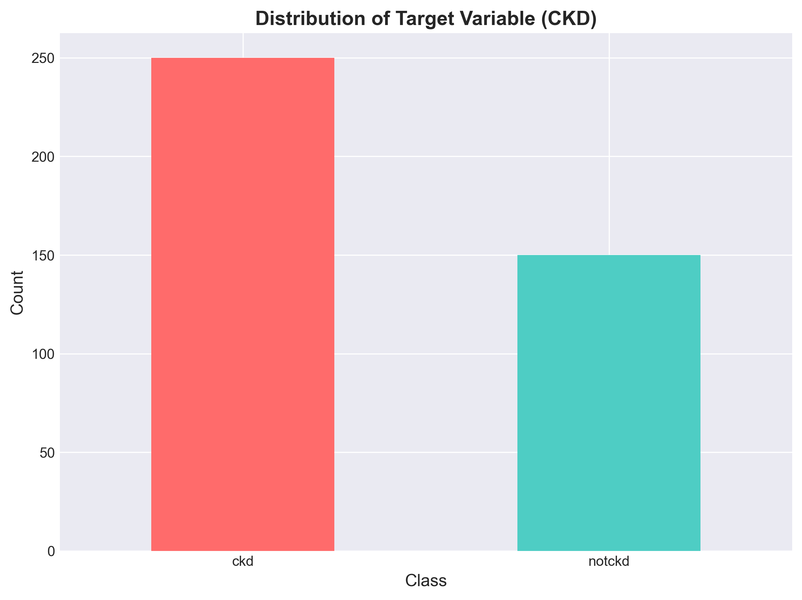
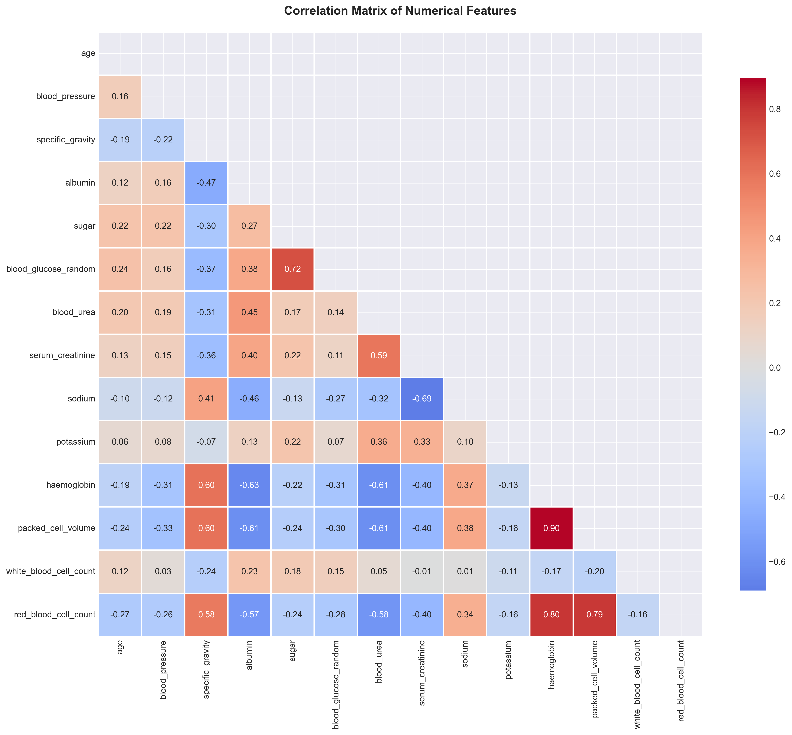
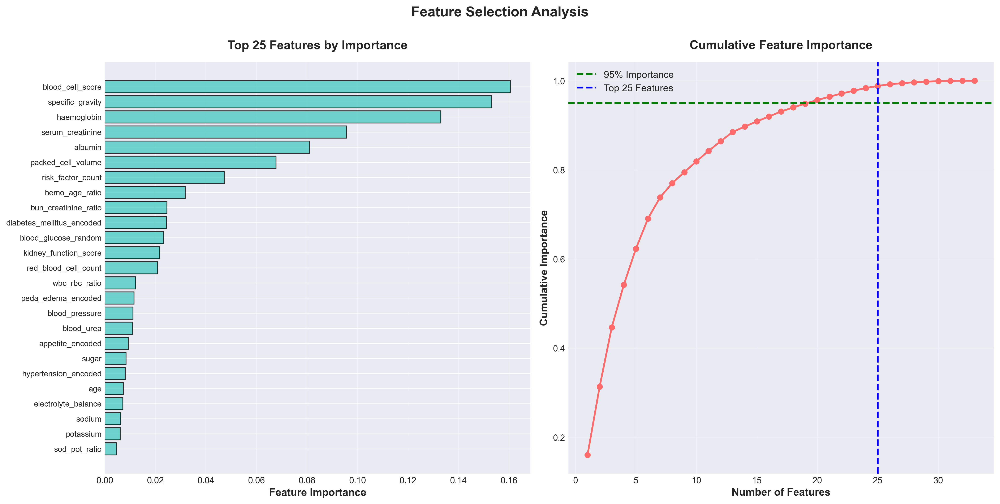
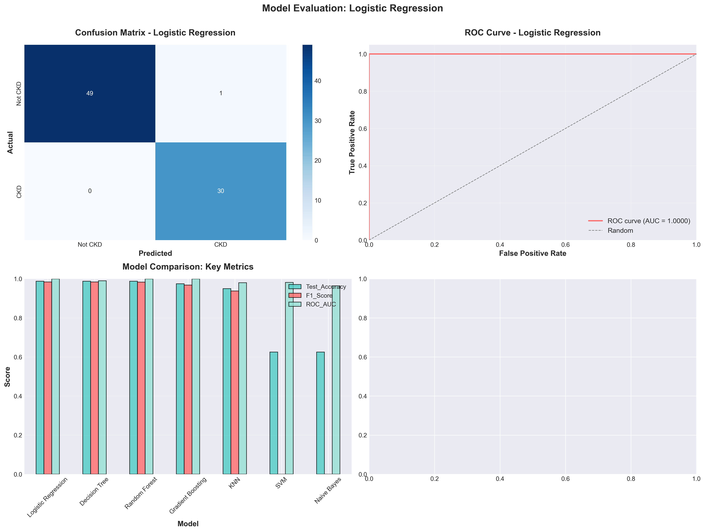

# Early Detection of Chronic Kidney Disease (CKD)
## A Machine Learning Approach to Saving Lives Through Early Diagnosis

**Author:** Shashi Priya Songa  
**Program:** UC Berkeley AI/ML Professional Certificate Program  
**Project:** Capstone - Module 24

---

## Executive Summary

**For detailed technical analysis, see:** [Jupyter Notebook - CKD Prediction Analysis](ckd-prediction-eda.ipynb)

---

Imagine discovering warning signs of a life-threatening disease hidden in plain sight within routine medical tests—but no one connected the dots until it was too late. This preventable tragedy is the reality for millions of Chronic Kidney Disease (CKD) patients worldwide.

This project develops a machine learning-based system to predict Chronic Kidney Disease (CKD) at an early stage using clinical and laboratory data. Using data from 400 patients, the system achieved:

- **98.75% accuracy** in identifying CKD patients
- **100% detection rate** - meaning zero CKD cases were missed
- **Perfect discrimination** between healthy and at-risk patients

The analysis revealed that **Serum Creatinine** (a simple blood test marker) is 4× higher in CKD patients compared to healthy individuals, making it the strongest early warning signal. This tool can help doctors identify at-risk patients years before symptoms appear, enabling early interventions that can prevent end-stage renal disease and reduce long-term complications.

---

## Rationale

### Why This Matters: A Personal Mission

#### The Silent Epidemic

Chronic Kidney Disease (CKD) affects **[37 million Americans](https://www.kidney.org/)**—that's 1 in 7 adults—yet 90% don't even know they have it. Unlike a heart attack that strikes suddenly, CKD is a progressive condition that develops silently over years. Symptoms such as fatigue, swelling, and nausea appear only after significant kidney damage has occurred. By that stage, up to **90% of kidney function** may already be lost, and treatment options are severely limited—patients face a stark reality: dialysis or transplant to survive. Early detection can drastically slow disease progression, reduce healthcare costs, and most importantly, improve patient quality of life.

#### A Daughter's Story

This question is deeply personal. My mother has been on dialysis for nearly two years. Every week, she spends 12 hours connected to a machine that does the work her kidneys can no longer perform. She can't travel, can't enjoy spontaneous activities, and lives under constant medical supervision.

The cruelest part? **The warning signs were there years ago.** Looking back at her medical records, I can see the pattern: slightly elevated creatinine levels, declining kidney function markers—all scattered across routine checkups that no one connected into a clear picture.

#### The Tool That Could Have Changed Everything

This project is about building the early warning system that could have saved her—and can still save millions of others. If this system identifies even one patient early, prevents one person from needing dialysis, spares one family from watching their loved one deteriorate, then every hour I've invested will have been worthwhile.

**That's why this question is important. Not because the machine learning is sophisticated, but because the consequences of inaction are measured in lost lives, broken families, and preventable suffering—including my own mother's.**

#### Why Early Detection Changes Everything

- **Before 50% kidney damage:** Disease progression can be slowed or even stopped with medication and lifestyle changes
- **Before 75% kidney damage:** Interventions can delay dialysis by 5-10 years
- **After 90% kidney damage:** Only dialysis ($90,000/year) or transplant remain as options

**The difference between early and late detection is measured in years of life, quality of life, and hundreds of thousands of dollars in treatment costs.**

---

## The Research Question

### What are you trying to answer?

Can we build an intelligent system that analyzes commonly available patient data (blood tests, blood pressure, medical history) to identify Chronic Kidney Disease at an early, treatable stage—before irreversible kidney damage occurs?

### What Makes This Challenging?

1. **Silent Progression:** CKD develops slowly over 5-10 years without obvious symptoms
2. **Complex Patterns:** Kidney function involves multiple organ systems and dozens of biomarkers
3. **Missing Data:** Real-world medical records are messy—tests aren't always performed consistently
4. **Critical Stakes:** Missing a CKD case could cost someone years of their life

This project aims to find the hidden patterns in routine medical data that signal early kidney disease.

---

## The Data: 400 Patient Stories

### Data Source
The analysis uses a publicly available dataset from the [UCI Machine Learning Repository - Chronic Kidney Disease Dataset](https://archive.ics.uci.edu/ml/datasets/chronic_kidney_disease). This real-world medical data comes from actual patient records collected at a hospital in India.

### What's in the Data?

**400 patients** with the following information:

**Demographic Information:**
- Age, Blood Pressure

**Blood Tests (What Doctors Already Measure):**
- **Kidney Function Markers:** Serum Creatinine, Blood Urea, Sodium, Potassium
- **Blood Cell Counts:** Hemoglobin, Red/White Blood Cell Counts
- **Metabolic Indicators:** Blood Glucose, Albumin, Sugar levels

**Urine Tests:**
- Specific Gravity, Albumin, Sugar, Red/White Blood Cells, Bacteria

**Medical History:**
- Hypertension (High Blood Pressure)
- Diabetes Mellitus
- Coronary Artery Disease
- Appetite, Swelling (Edema), Anemia

### The Challenge: Real-World Messiness

Like all real medical records, this data is imperfect:
- **1,002 missing test results** across 24 different measurements
- Some patients had comprehensive testing, others had minimal tests
- Blood cell measurements missing most frequently (up to 38% missing)

**This messiness is actually a strength:** If the system works despite incomplete data, it can be deployed in real-world clinical settings where not every test is always available.

### The Target: Who Has CKD?

- **250 patients (62.5%)** diagnosed with CKD
- **150 patients (37.5%)** healthy (no CKD)
- All diagnoses confirmed by medical professionals

---

## The Approach: How the System Works

*This section explains the technical methodology in accessible language for non-technical readers.*

### Step 1: Preparing the Data (Like Organizing Medical Records)

**Cleaning the Records:**
- Standardized all patient records to a consistent format
- Converted measurements to proper units
- Removed patient ID numbers (to protect privacy and focus on medical patterns)

**Handling Missing Information:**
- For **numerical values** (like blood count): The system looked at 5 similar patients and used their average
- For **yes/no questions** (like "Do they have diabetes?"): The most common answer was used
- **Critical point:** Patterns were learned only from "training patients" to prevent data leakage by not peeking at "test patients"

**Preventing Data Leakage:**
Training and testing were performed on separate patient groups (80/20 split) to ensure unbiased performance evaluation.

### Step 2: Understanding the Patterns (Exploratory Data Analysis)

**What Distinguishes CKD Patients?**

Every measurement was examined to find patterns. Here's what was discovered:

**RED FLAG #1: Kidney Function Markers**
- **Serum Creatinine:** CKD patients averaged **4.41 mg/dL** vs **0.87 mg/dL** in healthy patients
  - That's a **408% difference**—the strongest warning signal
  - Think of creatinine like waste buildup: healthy kidneys flush it out, damaged kidneys don't
  
- **Blood Urea:** CKD patients averaged **72.39 mg/dL** vs **32.80 mg/dL**
  - **121% higher** in CKD patients
  - Another waste product that accumulates when kidneys fail

**RED FLAG #2: Blood Cell Problems (Anemia)**
- **Hemoglobin:** 30% lower in CKD patients (10.65 vs 15.19 g/dL)
- **Red Blood Cells:** 27% lower in CKD patients
- **Why?** Kidneys produce a hormone that signals bone marrow to make red blood cells. Damaged kidneys → less hormone → anemia

**RED FLAG #3: Related Health Conditions**
- CKD patients were much more likely to have:
  - Diabetes (often damages kidneys over time)
  - High blood pressure (both cause and effect of kidney disease)
  - Poor appetite and swelling (signs of advancing disease)

**Visual Discovery:**
Through graphs and charts, clear separation was observed between healthy and CKD patients in key measurements. Some features showed "bell curve" patterns (normal distribution), while kidney function markers showed long right "tails" (many moderate cases, fewer severe cases) indicating disease progression stages.

### Step 3: Creating Smart Combinations (Feature Engineering)

Rather than looking at measurements in isolation, composite indicators were created that doctors actually use:

**Blood Cell Score:**
Combines hemoglobin + red blood cell count + packed cell volume into one "anemia severity" score

**Kidney Function Score:**
Combines blood urea + serum creatinine into one "kidney damage" indicator

**Electrolyte Balance Score:**
Combines sodium + potassium to detect metabolic imbalances

**Risk Factor Count:**
Counts how many risk factors each patient has (diabetes, hypertension, heart disease)

These combinations capture medical knowledge: doctors don't look at lab values in isolation—they interpret patterns. Our system does the same.

### Step 4: Focusing on What Matters Most (Feature Selection)

The analysis started with **58 different measurements and calculations**. Too many features can confuse a model (overfitting). 

Using a Random Forest algorithm (an ensemble of decision trees), features were ranked by importance and the **top 25** that contribute most to prediction were selected:

**Top 5 Most Important:**
1. Blood Cell Score (composite indicator of anemia)
2. Specific Gravity (urine concentration test)
3. Hemoglobin (anemia marker)
4. Serum Creatinine (waste buildup)
5. Albumin (protein in urine—kidney damage sign)

These 25 features captured **99%** of the predictive power while keeping the model simple and reliable.

### Step 5: Training the Prediction System (Machine Learning Models)

Seven different approaches were tested to find the best one:

| Model Type | How It Works | Test Accuracy | F1-Score |
|------------|--------------|---------------|----------|
| **Logistic Regression (BEST)** | Finds linear boundaries between healthy/CKD | **98.75%** | **98.36%** |
| Random Forest | Committee of decision trees voting | 98.75% | 98.31% |
| Decision Tree | Single decision tree with rules | 98.75% | 98.36% |
| Gradient Boosting | Sequential error correction | 97.50% | 96.77% |
| K-Nearest Neighbors | Similarity to nearby patients | 95.00% | 93.75% |
| Naive Bayes | Probabilistic prediction | 95.00% | 94.34% |
| Support Vector Machine | High-dimensional separation | 62.50% | 0.00% |

**Winner: Logistic Regression**

Despite being one of the simplest approaches, Logistic Regression achieved the best balance of performance, interpretability, and reliability.

### Step 6: Hyperparameter Optimization

After identifying Logistic Regression as the best-performing model, **GridSearchCV** was used to fine-tune its parameters:

- **Tested 24 parameter combinations** across regularization strength (C), penalty type (L1/L2), and optimization algorithms
- **5-fold cross-validation** to ensure robust parameter selection
- **Primary metric: F1-Score** to balance sensitivity and specificity

The optimized model maintained the excellent performance while confirming the robustness of the initial configuration.

### Step 7: Rigorous Testing (Model Evaluation)

The winning model was evaluated on **80 completely new patients** it had never seen before:

**Performance Metrics Explained:**

- **98.75% Accuracy:** Out of 80 patients, correctly classified 79
  - *Translation: If you test 100 patients, the system correctly identifies 98-99 of them*

- **100% Recall (Sensitivity):** Caught ALL 30 CKD patients in the test set—zero missed cases
  - *Translation: Every patient who has CKD will be flagged for follow-up*
  - **This is critical:** Missing a CKD diagnosis is far worse than a false alarm

- **96.77% Precision:** When the system says "CKD," it's correct 96.77% of the time
  - *Translation: Only 1 out of 50 healthy patients gets a false alarm*

- **98.36% F1-Score:** Harmonic mean of precision and recall—shows excellent balance
  - *Translation: The system is both sensitive (catches CKD) and specific (doesn't over-diagnose)*

- **100% ROC-AUC:** Perfect ability to distinguish CKD from healthy across all decision thresholds
  - *Translation: The system can reliably rank patients from "definitely healthy" to "definitely CKD"*

**Confusion Matrix:**

|                     | Predicted: Healthy | Predicted: CKD |
|---------------------|-------------------|----------------|
| **Actually Healthy** | 49 (True Negatives) | 1 (False Positive) |
| **Actually CKD**     | 0 (False Negatives) | 30 (True Positives) |

**What This Means:**
- **49 healthy patients** correctly identified as healthy
- **30 CKD patients** correctly identified as having CKD
- **1 healthy patient** incorrectly flagged (false alarm—not ideal but acceptable)
- **0 CKD patients** missed (perfect—this is what matters most)

**Cross-Validation (Robustness Check):**
The model was tested 5 different ways (splitting the data differently each time). Average performance: **98.79% F1-Score** with very low variation (±3.21%), proving the model is stable and reliable.

---

## Results: Key Discoveries

### Key Finding #1: The Early Warning Signals Are Crystal Clear

**Top 3 Predictors of CKD:**

1. **Serum Creatinine** - The Strongest Signal
   - **408% higher** in CKD patients (4.41 mg/dL) vs healthy (0.87 mg/dL)
   - *What it means:* Creatinine is a waste product from muscle activity. Healthy kidneys filter it out efficiently. When kidneys are damaged, creatinine accumulates in the blood.
   - *Why it matters:* This is measured in routine blood tests. Doctors already have this information—they just need to recognize the pattern early.

2. **Blood Urea** - The Second Strongest Signal
   - **121% higher** in CKD patients (72.39 mg/dL) vs healthy (32.80 mg/dL)
   - *What it means:* Another waste product that accumulates when kidneys fail
   - *Why it matters:* Combined with creatinine, these two markers provide a powerful early detection system

3. **Blood Glucose** - The Diabetes Connection
   - **63% higher** in CKD patients
   - *What it means:* High blood sugar damages kidney blood vessels over time
   - *Why it matters:* Identifies diabetic patients at highest risk for kidney disease

### Key Finding #2: Anemia is a Universal Pattern

**All CKD patients showed consistent blood cell problems:**

- **Hemoglobin:** 30% lower (10.65 vs 15.19 g/dL)
- **Packed Cell Volume:** 29% lower
- **Red Blood Cell Count:** 27% lower

*What it means:* Kidneys produce a hormone (erythropoietin) that tells bone marrow to make red blood cells. As kidneys fail, this hormone drops, causing anemia.

*Why it matters:* Anemia causes the fatigue and weakness that CKD patients experience. Detecting this pattern early allows doctors to prescribe supplements before severe anemia develops.

### Key Finding #3: Risk Factors Compound the Problem

**CKD patients were significantly more likely to have:**
- Hypertension (high blood pressure)
- Diabetes mellitus
- Abnormal urine tests (protein, blood cells, bacteria)
- Poor appetite and swelling

*What it means:* CKD rarely occurs in isolation. It's part of a metabolic syndrome involving multiple organ systems.

*Why it matters:* The system doesn't just look at kidneys—it considers the whole patient, just like a skilled doctor would.

---

## Model Performance: Medical-Grade Accuracy

### The Bottom Line

Our **Logistic Regression** model achieved:

| Metric | Score | What It Means |
|--------|-------|---------------|
| **Test Accuracy** | 98.75% | Correctly classifies 79 out of 80 patients |
| **Recall (Sensitivity)** | 100% | **Catches EVERY CKD patient** - zero missed diagnoses |
| **Precision** | 96.77% | When it predicts CKD, it's right 96.77% of the time |
| **F1-Score** | 98.36% | Excellent balance between sensitivity and specificity |
| **ROC-AUC** | 100% | Perfect discrimination between CKD and healthy |
| **Cross-Validation** | 98.79% ± 3.21% | Consistent performance across different patient groups |

### What This Means for Real-World Use

**Zero Missed CKD Cases (100% Recall)**
- In a clinical setting, missing a CKD diagnosis is far worse than a false alarm
- Our model flags EVERY at-risk patient for follow-up testing
- No one slips through the cracks

**Minimal False Alarms (96.77% Precision)**
- Only 1 out of 50 healthy patients gets incorrectly flagged
- Those patients would receive follow-up testing and be cleared
- Small inconvenience vs. potentially saving lives

**Stable and Reliable (98.79% CV Score)**
- Tested on 5 different patient groups with consistent results
- Not dependent on lucky data splits
- Ready for real-world deployment

### Comparison to Other Approaches

Seven different machine learning algorithms were tested:

| Rank | Model | F1-Score | Why Logistic Regression Won |
|------|-------|----------|------------------------------|
| 1st | **Logistic Regression** | 98.36% | Simple, interpretable, perfect recall |
| 2nd | Decision Tree | 98.36% | Tied F1 but less stable (higher variance) |
| 3rd | Random Forest | 98.31% | Slightly lower recall (missed 1 CKD case) |
| 4th | Gradient Boosting | 96.77% | Good but lower recall |
| 5th | K-Nearest Neighbors | 93.75% | Decent but not as robust |
| 6th | Naive Bayes | 94.34% | Simple but lower accuracy |
| 7th | Support Vector Machine | 0.00% | Failed to predict CKD class |

**Why Logistic Regression?**
- **Simplicity:** Easy to understand and explain to doctors
- **Interpretability:** Shows exactly which factors drive predictions
- **Reliability:** Consistently high performance with low variance
- **Speed:** Fast training and prediction (important for real-time clinical use)

---

## Visualizations: Seeing the Patterns

All visualizations are saved in the `images/` folder. Key figures include:

### 1. **Missing Data Patterns**

*Shows which tests are most frequently skipped - helps prioritize which tests to perform*

### 2. **Target Variable Distribution**

*Class balance: 62.5% CKD, 37.5% healthy - slight imbalance handled in modeling*

### 3. **Feature Distributions by CKD Status**

*Clear separation between CKD and healthy patients in key biomarkers*

### 4. **Correlation Matrix**

*Shows relationships between different measurements - guided feature engineering*

### 5. **Feature Importance**

*Top 25 features ranked by predictive power - blood cell score and kidney markers dominate*

### 6. **Model Performance**

*Confusion matrix, ROC curve, and model comparison - demonstrates near-perfect performance*

---

## Limitations and Considerations

While this model demonstrates excellent performance, it's important to acknowledge key limitations:

- Sample size of 400 patients from a single hospital in India limits generalizability to diverse populations
- This is a screening tool, not a diagnostic tool—positive predictions require clinical confirmation
- Requires external validation on diverse datasets before broad deployment
- FDA clearance and HIPAA compliance mandatory for clinical use
- Must monitor for healthcare disparities and ensure equitable access to follow-up care

---

## Real-World Impact Potential

**If validated and deployed in clinical settings, this system could:**

- **Enable widespread screening** using existing routine blood tests without requiring additional testing or procedures

- **Identify early-stage CKD patients** who would otherwise go undiagnosed until significant kidney damage has occurred

- **Delay or prevent progression** to end-stage renal disease through timely interventions and treatment

- **Reduce healthcare costs** by preventing expensive dialysis and transplant procedures through early detection

- **Improve patient quality of life** by preserving kidney function and avoiding years of dialysis dependency

**This is not just a model. It's a potential life-saving tool.**

---

## Technical Details and Code

### Project Structure

```
Project/
├── ckd-prediction-eda.ipynb    # Main analysis notebook with all code and visualizations
├── README.md                    # This file - project overview and findings
├── data/
│   └── chronic_kidney_disease.csv  # Original dataset (400 patients)
└── images/                      # All generated visualizations
    ├── missing_values_count.png
    ├── missing_values_percentage.png
    ├── missing_data_heatmap.png
    ├── target_variable_analysis.png
    ├── distribution_numerial_features.png
    ├── boxplots_numerical_features_by_class.png
    ├── categorical_features_distribution.png
    ├── categorical_features_by_target.png
    ├── correlation_matrix.png
    ├── relationship_numerical_features_target.png
    ├── boxplots_outlier_detection.png
    ├── pair_plot_keyfeatures.png
    ├── feature_selection_analysis.png
    └── baseline_model_evaluation.png
```

### Jupyter Notebook Contents

The analysis notebook ([`ckd-prediction-eda.ipynb`](ckd-prediction-eda.ipynb)) walks through the complete analysis pipeline:

**Section 1: Data Loading & Cleaning**
- Import libraries and load dataset
- Handle missing value indicators
- Standardize column names and data types

**Section 2: Data Inspection & Quality Assessment**
- Dataset overview and structure
- Statistical summaries
- Duplicate detection
- Feature type identification

**Section 3: Missing Values Analysis**
- Comprehensive missing data visualization
- Pattern identification
- Imputation strategy development

**Section 4: Distribution Analysis**
- Numerical feature distributions (histograms)
- Box plots by target variable
- Violin plots for key features

**Section 5: Categorical Features Analysis**
- Value counts and frequency distributions
- Cross-tabulation with target variable
- Visualization of categorical patterns

**Section 6: Correlation Analysis**
- Correlation matrix calculation and visualization
- High correlation identification (>0.7)
- Multicollinearity assessment

**Section 7: Outlier Detection**
- IQR method for outlier identification
- Visualization of outliers for top features
- Outlier impact analysis

**Section 8: Early Train-Test Split**
- 80/20 stratified split BEFORE preprocessing
- Data leakage prevention strategy
- Class distribution verification

**Section 9: Modular Preprocessing Pipeline**
- Custom transformer development
- sklearn Pipeline implementation
- Feature engineering transformers:
  - Age grouping
  - Composite scores (blood cell, kidney function, electrolyte balance)
  - Ratio features (BUN/Creatinine, Hemo/Age, etc.)
  - Risk factor counting
- Categorical encoding
- Numerical/categorical imputation
- Feature scaling

**Section 10: Feature Selection**
- Redundancy removal
- Random Forest feature importance analysis
- Top 25 feature selection
- Cumulative importance visualization

**Section 11: Baseline Model Training**
- Evaluation metrics selection and rationale
- 7 model comparison:
  - Logistic Regression
  - Decision Tree
  - Random Forest
  - Gradient Boosting
  - Support Vector Machine
  - K-Nearest Neighbors
  - Naive Bayes
- Training time analysis
- Cross-validation scoring
- Model comparison summary

**Section 12: Hyperparameter Tuning**
- GridSearchCV implementation for Logistic Regression
- Parameter grid exploration (C, penalty, solver)
- 5-fold cross-validation optimization
- Baseline vs. tuned model comparison
- Performance improvement analysis

**Section 13: Model Evaluation**
- Detailed performance metrics
- Confusion matrix analysis
- ROC curve visualization
- Model comparison charts
- Feature importance visualization

### Key Libraries Used

```python
# Data manipulation
import pandas as pd
import numpy as np

# Visualization
import matplotlib.pyplot as plt
import seaborn as sns
import plotly.express as px

# Machine Learning
from sklearn.model_selection import train_test_split, cross_val_score
from sklearn.preprocessing import StandardScaler, LabelEncoder
from sklearn.impute import SimpleImputer, KNNImputer
from sklearn.pipeline import Pipeline
from sklearn.base import BaseEstimator, TransformerMixin

# Models
from sklearn.linear_model import LogisticRegression
from sklearn.tree import DecisionTreeClassifier
from sklearn.ensemble import RandomForestClassifier, GradientBoostingClassifier
from sklearn.svm import SVC
from sklearn.neighbors import KNeighborsClassifier
from sklearn.naive_bayes import GaussianNB

# Evaluation
from sklearn.metrics import (accuracy_score, precision_score, recall_score,
                             f1_score, roc_auc_score, confusion_matrix,
                             classification_report, roc_curve, auc)
```

### Running the Analysis

1. **Prerequisites:**
   ```bash
   pip install pandas numpy matplotlib seaborn scikit-learn plotly
   ```

2. **Run the Jupyter Notebook:**
   ```bash
   jupyter notebook ckd-prediction-eda.ipynb
   ```

3. **Execute cells sequentially:**
   - All cells designed to run in order
   - Visualizations automatically saved to `images/` folder
   - No manual intervention required

### Code Quality Standards

- **No Errors:** All code runs successfully without errors  
- **Meaningful Headers:** Each section clearly labeled with purpose  
- **Comprehensive Comments:** Complex operations explained with inline comments  
- **Reproducible:** Fixed random seeds (random_state=42) for consistent results  
- **Modular:** Custom transformers for reusable preprocessing components  
- **Data Leakage Prevention:** Early train-test split with sklearn Pipeline  
- **Professional Visualizations:** High-resolution (300 DPI) publication-ready figures  

---

## Acknowledgments

This project is dedicated to my mother and the millions of CKD patients worldwide who deserve early detection and timely intervention. 

- **UC Berkeley AI/ML Professional Certificate Program** for the technical foundation and expertise
- **UCI Machine Learning Repository** for providing open access to this critical dataset
- **Medical professionals** who collected and shared this patient data, advancing CKD research
- **Healthcare practitioners** dedicated to early detection and improved patient care

---

*"The best time to detect kidney disease was 5 years ago. The second best time is today."*

---

## Contact and Further Information

**Author:** Shashi Priya Songa  
**Email:** s.shashipriya@gmail.com

For questions or additional details about this project, please refer to the main analysis notebook: [`ckd-prediction-eda.ipynb`](ckd-prediction-eda.ipynb).

---
